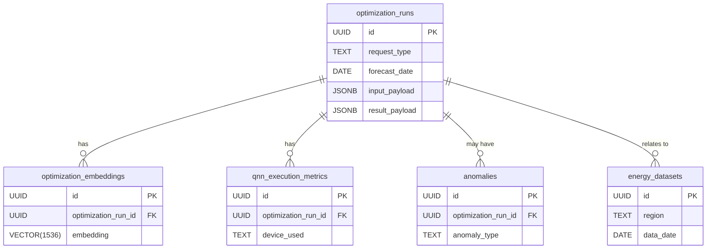

# 📊 Energy Grid Load Optimizer — Postgres Data Model

---

### 1️⃣ `optimization_runs`

This is the core log of every QNN API request and response.

```sql
CREATE TABLE optimization_runs (
    id UUID PRIMARY KEY DEFAULT gen_random_uuid(),
    request_type TEXT CHECK (request_type IN ('forecast', 'storage', 'grid_switch', 'simulation')),
    region TEXT NOT NULL,
    forecast_date DATE NOT NULL,
    input_payload JSONB NOT NULL,
    result_payload JSONB,
    status TEXT DEFAULT 'completed',
    qnn_model_id TEXT,
    qnn_execution_time DOUBLE PRECISION,
    created_at TIMESTAMP DEFAULT now()
);
```

---

### 2️⃣ `energy_datasets`

Optional: Used if you later start collecting historical data for fine-tuning / evaluation.

```sql
CREATE TABLE energy_datasets (
    id UUID PRIMARY KEY DEFAULT gen_random_uuid(),
    region TEXT NOT NULL,
    data_date DATE NOT NULL,
    historical_loads DOUBLE PRECISION[],
    weather_data JSONB,
    pricing_schedule JSONB,
    storage_state JSONB,
    created_at TIMESTAMP DEFAULT now()
);
```

---

### 3️⃣ `optimization_embeddings`

This table stores **vector embeddings** of prior optimization scenarios for similarity search & retrieval (future reinforcement, semantic search, or model chaining).

```sql
CREATE TABLE optimization_embeddings (
    id UUID PRIMARY KEY DEFAULT gen_random_uuid(),
    optimization_run_id UUID REFERENCES optimization_runs(id) ON DELETE CASCADE,
    embedding VECTOR(1536), -- OpenAI or QNN Vector size (adjust depending on model used)
    created_at TIMESTAMP DEFAULT now()
);
```

> ✅ The `VECTOR` type assumes you’ve enabled pgvector extension:

```sql
CREATE EXTENSION IF NOT EXISTS vector;
```

---

### 4️⃣ `qnn_execution_metrics`

Optional: Fine-grained tracking of QNN execution details for debugging or cost optimization.

```sql
CREATE TABLE qnn_execution_metrics (
    id UUID PRIMARY KEY DEFAULT gen_random_uuid(),
    optimization_run_id UUID REFERENCES optimization_runs(id) ON DELETE CASCADE,
    device_used TEXT,
    circuit_depth INT,
    n_qubits INT,
    execution_time_ms DOUBLE PRECISION,
    quantum_cost_usd DOUBLE PRECISION,
    created_at TIMESTAMP DEFAULT now()
);
```

---

### 5️⃣ `anomalies` (stretch goal)

Optional: Integrates with `/api/v1/monitoring/anomalies/` QNN endpoint.

```sql
CREATE TABLE anomalies (
    id UUID PRIMARY KEY DEFAULT gen_random_uuid(),
    optimization_run_id UUID REFERENCES optimization_runs(id) ON DELETE CASCADE,
    anomaly_type TEXT,
    severity TEXT,
    description TEXT,
    suggested_actions TEXT[],
    resolved BOOLEAN DEFAULT FALSE,
    detected_at TIMESTAMP,
    resolved_at TIMESTAMP
);
```

---

# 🔑 Summary ERD



---

# 🚀 Why this model is production-grade:

* ✅ Fully normalized for audit and traceability
* ✅ QNN-centric design allows tight coupling to API responses
* ✅ Vector support ready for future agentic RAG workflows
* ✅ Simple enough for your **1-hour prototype**

---

